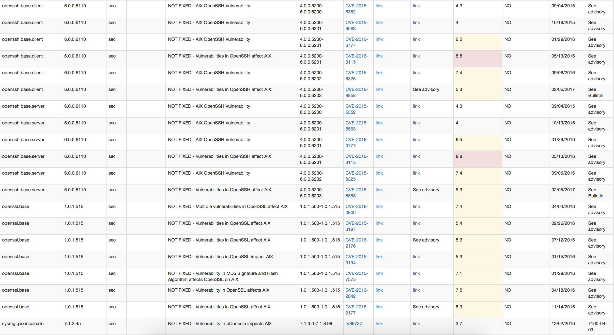

##EARLY WIP

Place this python script and IBM's flrtvg.ksh in same directory.  
Plase output of lslpp -Lqc and emgr -lv3 named as
"hostname\_lslpp.info" and "hostname\_emgr.info". 

Run python script

It will produce hostname.html and a stupid index page.

IBM's [flrtvc.ksh](https://www-304.ibm.com/webapp/set2/sas/f/flrt/flrtvc.html)
